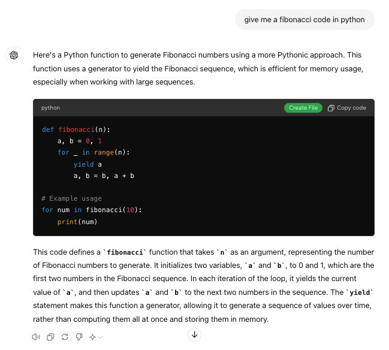
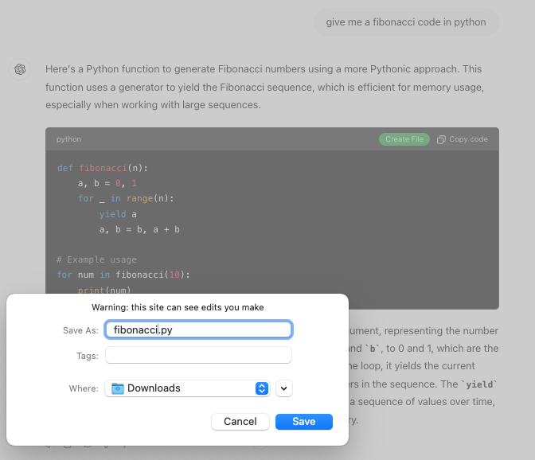

# ChatGPT Code Snippet Download Extension 🛠️

This repository contains JavaScript scripts for browser extensions that enhance code snippet functionality on ChatGPT-generated websites. It adds a "Create File" button to code snippet containers, allowing users to download the code with an appropriate file extension based on the detected programming language.

## Features

- Adds "Create File" buttons 🆕 to code snippet containers dynamically.
- Detects the programming language from the container's content.
- Supports multiple programming languages:
  - JavaScript 📜 (`*.js`)
  - Python 🐍 (`*.py`)
  - C# 🎯 (`*.cs`)
  - C++ ⚙️ (`*.cpp`)
  - Ruby 💎 (`*.rb`)
- Defaults to the detected language's extension for unrecognized languages 🏷️.
- Utilizes the `showSaveFilePicker` browser API for saving files where supported, with a fallback mechanism for other browsers 🔙.

## Screenshots

## How to Use

### Prerequisites
- Google Chrome or Mozilla Firefox browser.
- Access to a ChatGPT-generated website where code snippets are displayed.

### Loading the Extension in Chrome (Developer Mode)
1. **Download the Extension**:
   - Clone the repository or download the extension files to your local machine.

2. **Open Chrome Extensions**:
   - Enter `chrome://extensions/` in the Chrome address bar.
   - Enable "Developer mode" by toggling the switch in the top-right corner.

3. **Load the Unpacked Extension**:
   - Click on the "Load unpacked" button.
   - Navigate to the directory where you saved the extension files and select it.
   - The extension should now be added to your browser and active.

### Loading the Extension in Firefox (Debug Mode)
1. **Download the Extension**:
   - Clone the repository or download the extension files to your local machine.

2. **Open Firefox Add-ons**:
   - Enter `about:debugging` in the Firefox address bar.
   - Click on "This Firefox" or “Firefox” on the sidebar (depends on your Firefox version).

3. **Load Temporary Add-on**:
   - Click on “Load Temporary Add-on…”.
   - Open the extension’s directory and select any file within it to load the extension.
   - The extension should now appear in your browser and will remain active until you restart Firefox.

### After Installation
- Navigate to the ChatGPT-generated website where code snippets are displayed.
- The extension will automatically add "Create File" buttons to each code snippet container.
- Click the "Create File" button to save the code snippet with the correct file extension, based on the detected programming language.

### Notes
- Since these extensions are loaded in developer or debug mode, they are not permanently installed. In Firefox, the extension will need to be reloaded if the browser is restarted.
- Ensure the webpage's structure and styling are compatible with the extension's selectors for optimal functionality.

## License
This project is licensed under the MIT License - see the LICENSE file for details.

---

# ChatGPT 程式碼片段下載 🛠️

本倉庫包含用於瀏覽器擴展的 JavaScript 腳本，這些擴展增強了 ChatGPT 生成的網站上的程式碼片段功能。它會在程式碼片段容器中添加“創建文件”按鈕，讓用戶根據檢測到的程式語言下載具有適當文件擴展名的程式碼。

## 特點

- 動態添加“創建文件”按鈕 🆕 到程式碼片段容器。
- 從容器的內容中檢測程式語言。
- 支持多種程式語言：
  - JavaScript 📜（`*.js`）
  - Python 🐍（`*.py`）
  - C# 🎯（`*.cs`）
  - C++ ⚙️（`*.cpp`）
  - Ruby 💎（`*.rb`）
- 對於無法識別的語言默認使用該語言的擴展名 🏷️。
- 在支持的情況下使用 `showSaveFilePicker` 瀏覽器 API 進行文件保存，並為其他瀏覽器提供回退機制 🔙。

## 截圖

## 如何使用

### 前提條件
- Google Chrome 或 Mozilla Firefox 瀏覽器。
- 能夠訪問顯示程式碼片段的 ChatGPT 生成的網站。

### 在 Chrome 中加載擴展（開發者模式）
1. **下載擴展**：
   - 克隆倉庫或將擴展文件下載到您的本地機器。

2. **打開 Chrome 擴展**：
   - 在 Chrome 地址欄輸入 `chrome://extensions/`。
   - 通過在右上角切換開關啟用“開發者模式”。

3. **加載未打包擴展**：
   - 點擊“加載未打包”按鈕。
   - 導航到您保存擴展文件的目錄並選擇它。
   - 擴展應該現在已添加到您的瀏覽器並處於活動狀態。

### 在 Firefox 中加載擴展（調試模式）
1. **下載擴展**：
   - 克隆倉庫或將擴展文件下載到您的本地機器。

2. **打開 Firefox 附加組件**：
   - 在 Firefox 地址欄輸入 `about:debugging`。
   - 點擊側邊欄上的“這個 Firefox”或“Firefox”（取決於您的 Firefox 版本）。

3. **加載臨時附加組件**：
   - 點擊“加載臨時附加組件...”。
   - 打開擴展的目錄並選擇其中任何一個文件以加載擴展。
   - 擴展現在應該顯示在您的瀏覽器中，並將保持活動狀態直到您重啟 Firefox。

### 安裝後
- 導航到顯示程式碼片段的 ChatGPT 生成的網站。
- 擴展將自動為每個程式碼片段容器添加“創建文件”按鈕。
- 點擊“創建文件”按鈕以保存程式碼片段，文件擴展名根據檢測到的程式語言確定。

### 注意事項
- 由於這些擴展在開發者或調試模式下加載，它們並未永久安裝。在 Firefox 中，如果瀏覽器重新啟動，則需要重新加載擴展。
- 確保網頁的結構和樣式與擴展的選擇器兼容，以實現最佳功能。

## 許可證
本項目採用 MIT 許可證，詳情請見 LICENSE 文件。
